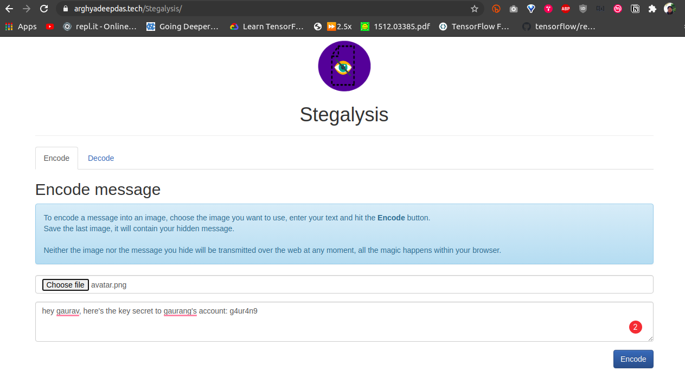
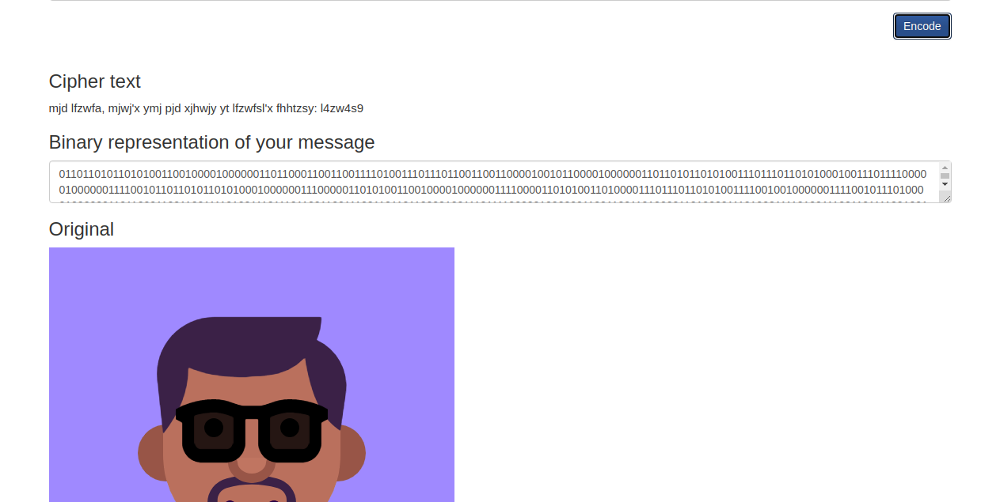

<h1 align="center">:microscope::chart_with_upwards_trend: Stegalysis :mortar_board::bookmark_tabs:</h1>

</img>

 

 

## What is Steganography?

Steganography is the art of hiding a message inside another message. In our case, we will hide a text message inside an image. An image will most propably go unnotified, most of the people will not suspect a message hidden inside of an image.

## Implementation Details

The User chooses an image, the image data is then normalized, meaning that each RGB value is decremented by one if it is not even. This is done for every pixel in the image.

Next, the message is encrypted using **Caesar Cipher** as a layer of security. Then, this cipher is converted to a binary representation, 8 bits per character of the message. This binary representation is then applied to the normalized image, 3 bit per pixel. This concludes, that the maximal length of a message hidden in 
an image is:

    Image Width * Image Height * 3
    ------------------------------
                  8

Since the image was normalized, we now know that an **even** r, g or b value is **0** and an **uneven** is a **1**. And this is how the cipher is decoded back from the image. We now decrypt the given cipher back to original text. 

## Additional layers of security

Steganography is no means of encryption, just a way to hide data from plain sight. But one can, for example, hide a PGP-encrypted message inside an image. So even if the image did not go unnoticed, the message would still only  be readable by the person it was addressed to. From our side, we add an extra Caesar cipher to increase security. 

---

<h3 align="center">Stegalysis as a webapp:</h3>

<h4 align="center">Encoding</h4>

 

<h4 align="center">Decoding</h4>

 

 

---

### Future scope of this project:

* [ ] Provide more encryption methods for texts. 
* [ ] Implement more decryption logics that are widely used (posisble). 

### Tech Stack of this Project:

* Frontend: HTML/CSS
* Backend: JavaScript

### To try the webapp:

* Visit [Stegalysis](https://arghyadeepdas.tech/Stegalysis/)

For encoding:
* In the Encode tab, upload an image. 
* Type in the text to be hidden and press Encode.
* You get to see the encrypted text, the binary representation of the cipher, normalized image and the final image. 
* The user can press "Download Image" to download the final image. 

For decoding:
* In the decode tab, upload the  image suspected to contain hidden text. 
* **Remember to upload only those images that have been generated using Stegalysis, since the logic is unique to this project**. 
* Press Decode. 
* It will display the hidden cipher and decrypted message along with the image.

#### This project still has scope of development, so you can also contribute to this Project as follows:
* [Fork](https://github.com/arghyadeep99/Stegalysis) this Repository.
* Clone your Fork on a different branch:
	* `git clone -b <name-of-branch> https://github.com/arghyadeep99/Stegalysis.git`
* After adding any feature:
	* Goto your fork and create a pull request.
	* We will test your modifications and merge changes.

This project was done as an assignment of our lab course `Cryptography and Security Systems`.

---
<h3 align="center"><b>Developed with :heart: by <a href="https://github.com/g-bhagwanani">Gaurav Bhagwanani</a>, <a href="https://github.com/arghyadeep99">Arghyadeep Das</a> and <a href="https://github.com/GaurangAthavale">Gaurang Athavale</a>.</b></h1>
